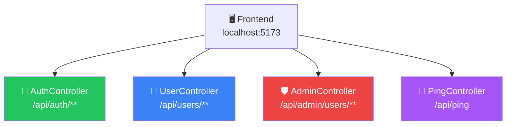
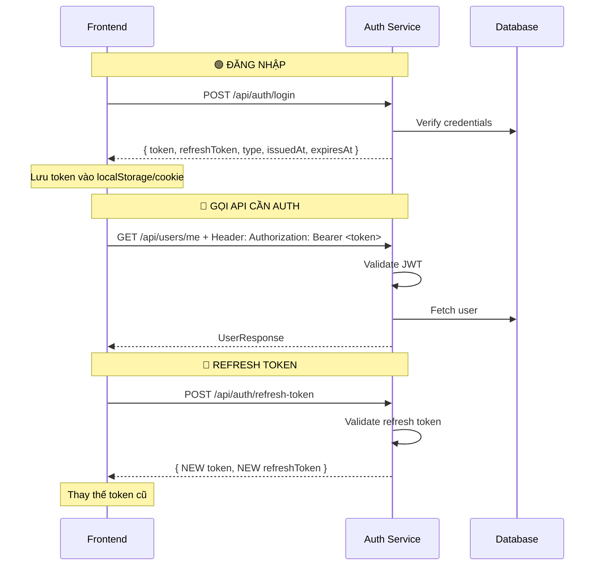

# 📋 BÁO CÁO PHÂN TÍCH AUTH-SERVICE API
## Dành cho Frontend Authentication Module

> **Base URL**: `http://localhost:8080`
> **Swagger UI**: `http://localhost:8080/swagger-ui.html`
> **Architecture**: Clean Architecture (Domain → Application → Infrastructure → Presentation)
> **Auth Type**: JWT Bearer Token (HS256)
> **Database**: PostgreSQL

---

## 📑 MỤC LỤC

1. [Tổng quan kiến trúc](#1-tổng-quan-kiến-trúc)
2. [Danh sách API Endpoints](#2-danh-sách-api-endpoints)
3. [Chi tiết từng API](#3-chi-tiết-từng-api)
4. [Cấu trúc Response chung](#4-cấu-trúc-response-chung)
5. [Hệ thống Error Codes](#5-hệ-thống-error-codes)
6. [JWT Token Flow](#6-jwt-token-flow)
7. [CORS Configuration](#7-cors-configuration)
8. [Checklist Frontend](#8-checklist-frontend)

---

## 1. Tổng quan kiến trúc



| Layer | Mô tả |
|---|---|
| **Presentation** | Controllers + Response wrappers + GlobalExceptionHandler |
| **Application** | Use Cases (interfaces) + Services (impl) + DTOs |
| **Domain** | Entities (User, Role) + Repositories (interfaces) + Error Codes |
| **Infrastructure** | JPA persistence + JWT security + Email sender + Security config |

---

## 2. Danh sách API Endpoints

### 🟢 Public APIs (Không cần Token)

| # | Method | Endpoint | Mô tả |
|---|--------|----------|--------|
| 1 | `POST` | `/api/auth/register/request-otp` | Đăng ký Bước 1: Gửi OTP về email |
| 2 | `POST` | `/api/auth/register` | Đăng ký Bước 2: Tạo tài khoản + xác thực OTP |
| 3 | `POST` | `/api/auth/login` | Đăng nhập hệ thống |
| 4 | `POST` | `/api/auth/forgot-password/request` | Quên MK Bước 1: Gửi OTP về email |
| 5 | `POST` | `/api/auth/forgot-password/reset` | Quên MK Bước 2: Xác nhận OTP + đổi mật khẩu |
| 6 | `POST` | `/api/auth/refresh-token` | Làm mới Access Token |

### 🔵 Protected APIs (Yêu cầu Bearer Token)

| # | Method | Endpoint | Mô tả |
|---|--------|----------|--------|
| 7 | `GET` | `/api/users/me` | Lấy thông tin profile cá nhân |
| 8 | `PUT` | `/api/users/profile` | Cập nhật hồ sơ (phone, dob) |
| 9 | `POST` | `/api/users/change-password` | Đổi mật khẩu (cần mật khẩu cũ) |

### 🟣 Health Check

| # | Method | Endpoint | Mô tả |
|---|--------|----------|--------|
| 10 | `GET` | `/api/ping` | Kiểm tra server còn sống |

### 🔴 Admin APIs (Yêu cầu Token + Role ADMIN) — *Không dùng cho End-User FE*

| # | Method | Endpoint | Mô tả |
|---|--------|----------|--------|
| 11 | `POST` | `/api/admin/users/test-bulk-insert` | Test insert 10.000 user |
| 12 | `POST` | `/api/admin/users/import-excel` | Import user từ file Excel |

---

## 3. Chi tiết từng API

---

### 🟢 API #1 — Đăng ký: Yêu cầu gửi OTP

```
POST /api/auth/register/request-otp
```

**Request Body:**
```json
{
  "clientId": "ecommerce-web",     // ⚠️ BẮT BUỘC — ID ứng dụng đã đăng ký SSO
  "email": "user@example.com"      // ⚠️ BẮT BUỘC — Email format
}
```

**Validation Rules:**
| Field | Rule |
|-------|------|
| `clientId` | `@NotBlank` |
| `email` | `@NotBlank` + `@Email` |

**Response (200 OK):**
```json
{
  "success": true,
  "data": null,
  "message": "Mã OTP đã được gửi đến email của bạn.",
  "timestamp": "2026-04-14T04:00:00Z"
}
```

**Possible Errors:**
| ErrorCode | HTTP | Khi nào |
|-----------|------|---------|
| `AUTH_002` | 400 | Email đã được sử dụng |
| `VALIDATION_ERROR` | 400 | Dữ liệu không hợp lệ |

> [!IMPORTANT]
> OTP có hiệu lực **2 phút** (cấu hình `application.security.otp.expiration-minutes=2`). Frontend cần hiện countdown timer.

---

### 🟢 API #2 — Đăng ký: Tạo tài khoản

```
POST /api/auth/register
```

**Request Body:**
```json
{
  "clientId": "ecommerce-web",       // ⚠️ BẮT BUỘC
  "username": "phucdoan",            // ⚠️ BẮT BUỘC — 4-20 ký tự
  "email": "phucdoan849@gmail.com",  // ⚠️ BẮT BUỘC — Email format
  "password": "MatKhauManh@123",     // ⚠️ BẮT BUỘC — Tối thiểu 6 ký tự
  "dob": "1999-12-31",               // Tùy chọn — Format: YYYY-MM-DD
  "phone": "0987654321",             // Tùy chọn
  "otpCode": "123456"                // ⚠️ BẮT BUỘC — 6 chữ số từ email
}
```

**Validation Rules:**
| Field | Rule |
|-------|------|
| `clientId` | `@NotBlank` |
| `username` | `@NotBlank` + `@Size(min=4, max=20)` |
| `email` | `@NotBlank` + `@Email` |
| `password` | `@NotBlank` + `@Size(min=6)` |
| `dob` | Optional — `LocalDate` format `YYYY-MM-DD` |
| `phone` | Optional |
| `otpCode` | `@NotBlank` |

**Response (200 OK):**
```json
{
  "success": true,
  "data": {
    "id": "550e8400-e29b-41d4-a716-446655440000",
    "username": "phucdoan",
    "email": "phucdoan849@gmail.com",
    "dob": "1999-12-31",
    "phone": "0987654321",
    "enabled": true,
    "dobUpdated": false,
    "appRoles": {
      "ecommerce-web": ["USER"]
    }
  },
  "message": "Đăng ký tài khoản thành công!",
  "timestamp": "2026-04-14T04:00:00Z"
}
```

**Possible Errors:**
| ErrorCode | HTTP | Khi nào |
|-----------|------|---------|
| `AUTH_001` | 400 | Username đã tồn tại |
| `AUTH_002` | 400 | Email đã được sử dụng |
| `SYS_002` | 400 | OTP sai / hết hạn / đã dùng |
| `SYS_002` | 400 | clientId không hợp lệ |

---

### 🟢 API #3 — Đăng nhập

```
POST /api/auth/login
```

**Request Body:**
```json
{
  "clientId": "ecommerce-web",                // ⚠️ BẮT BUỘC
  "usernameOrEmail": "phucdoan849@gmail.com",  // ⚠️ BẮT BUỘC — Nhận cả username và email
  "password": "MatKhauManh@123"                // ⚠️ BẮT BUỘC
}
```

**Validation Rules:**
| Field | Rule |
|-------|------|
| `clientId` | `@NotBlank` |
| `usernameOrEmail` | `@NotBlank` |
| `password` | `@NotBlank` |

**Response (200 OK):**
```json
{
  "success": true,
  "data": {
    "token": "eyJhbGciOiJIUzI1NiJ9...",
    "refreshToken": "eyJhbGciOiJIUzI1NiJ9...",
    "type": "Bearer",
    "issuedAt": "2026-04-14T04:00:00Z",
    "expiresAt": "2026-04-15T04:00:00Z"
  },
  "message": "Đăng nhập thành công!",
  "timestamp": "2026-04-14T04:00:00Z"
}
```

**Possible Errors:**
| ErrorCode | HTTP | Khi nào |
|-----------|------|---------|
| `AUTH_003` | 401 | Sai username/email hoặc password |
| `AUTH_006` | 403 | Tài khoản bị vô hiệu hóa |
| `SYS_002` | 400 | clientId không tồn tại |
| `SYS_002` | 400 | User không có quyền truy cập app này |

> [!TIP]
> **JWT Claims được nhúng trong Access Token:**
> - `sub` = User ID (UUID)
> - `username` = Tên đăng nhập
> - `email` = Email
> - `app_roles` = `{ "ecommerce-web": ["USER"] }`
>
> Frontend có thể decode token (thư viện `jwt-decode`) để hiển thị thông tin user mà không cần gọi API `/me`.

---

### 🟢 API #4 — Quên mật khẩu: Gửi OTP

```
POST /api/auth/forgot-password/request
```

**Request Body:**
```json
{
  "clientId": "ecommerce-web",      // ⚠️ BẮT BUỘC
  "email": "tienphong@gmail.com"    // ⚠️ BẮT BUỘC — Email format
}
```

**Response (200 OK):**
```json
{
  "success": true,
  "data": null,
  "message": "Mã OTP đã được gửi đến email của bạn.",
  "timestamp": "2026-04-14T04:00:00Z"
}
```

**Possible Errors:**
| ErrorCode | HTTP | Khi nào |
|-----------|------|---------|
| `AUTH_004` | 404 | Email chưa đăng ký |

---

### 🟢 API #5 — Quên mật khẩu: Reset

```
POST /api/auth/forgot-password/reset
```

**Request Body:**
```json
{
  "email": "phucdoan849@gmail.com",  // ⚠️ BẮT BUỘC
  "otpCode": "654321",               // ⚠️ BẮT BUỘC
  "newPassword": "NewPassword123",   // ⚠️ BẮT BUỘC — Tối thiểu 6 ký tự
  "confirmPassword": "NewPassword123" // ⚠️ BẮT BUỘC — Phải khớp newPassword
}
```

**Response (200 OK):**
```json
{
  "success": true,
  "data": null,
  "message": "Đặt lại mật khẩu thành công. Bạn có thể đăng nhập.",
  "timestamp": "2026-04-14T04:00:00Z"
}
```

**Possible Errors:**
| ErrorCode | HTTP | Khi nào |
|-----------|------|---------|
| `AUTH_004` | 404 | Email không tìm thấy |
| `AUTH_005` | 400 | newPassword ≠ confirmPassword |
| `SYS_002` | 400 | OTP sai / hết hạn / đã dùng |

---

### 🟢 API #6 — Refresh Token

```
POST /api/auth/refresh-token
```

**Request Body:**
```json
{
  "clientId": "ecommerce-web",                       // ⚠️ BẮT BUỘC
  "refreshToken": "eyJhbGciOiJIUzI1NiJ9..."         // ⚠️ BẮT BUỘC
}
```

**Response (200 OK):** Giống response Login (trả về cặp token mới)
```json
{
  "success": true,
  "data": {
    "token": "NEW_ACCESS_TOKEN",
    "refreshToken": "NEW_REFRESH_TOKEN",
    "type": "Bearer",
    "issuedAt": "...",
    "expiresAt": "..."
  },
  "message": "Làm mới Token thành công!",
  "timestamp": "..."
}
```

**Possible Errors:**
| ErrorCode | HTTP | Khi nào |
|-----------|------|---------|
| `SYS_999` | 500 | Refresh token hết hạn hoặc không hợp lệ |
| `AUTH_004` | 404 | User không tìm thấy |
| `SYS_002` | 400 | User bị disable |

---

### 🔵 API #7 — Lấy Profile cá nhân

```
GET /api/users/me
Authorization: Bearer <access_token>
```

**Response (200 OK):**
```json
{
  "success": true,
  "data": {
    "id": "550e8400-e29b-41d4-a716-446655440000",
    "username": "phucdoan",
    "email": "phucdoan849@gmail.com",
    "dob": "1999-12-31",
    "phone": "0987654321",
    "enabled": true,
    "dobUpdated": false,
    "appRoles": {
      "ecommerce-web": ["USER"]
    }
  },
  "message": "Lấy thông tin thành công",
  "timestamp": "..."
}
```

**Possible Errors:**
| ErrorCode | HTTP | Khi nào |
|-----------|------|---------|
| `SEC_001` | 401 | Chưa đăng nhập / Token hết hạn |
| `AUTH_004` | 404 | User không tìm thấy |

---

### 🔵 API #8 — Cập nhật Profile

```
PUT /api/users/profile
Authorization: Bearer <access_token>
```

**Request Body:**
```json
{
  "phone": "0912345678",     // Tùy chọn — Regex: ^(0|84)(3|5|7|8|9)[0-9]{8}$
  "dob": "2000-01-01"        // Tùy chọn — Phải là ngày trong quá khứ. CHỈ ĐỔI 1 LẦN!
}
```

**Validation Rules:**
| Field | Rule |
|-------|------|
| `phone` | `@Pattern(^(0\|84)(3\|5\|7\|8\|9)[0-9]{8}$)` — SĐT Việt Nam |
| `dob` | `@Past` — Phải là ngày trong quá khứ |

**Response (200 OK):** Trả về `UserResponse` cập nhật mới nhất.

**Possible Errors:**
| ErrorCode | HTTP | Khi nào |
|-----------|------|---------|
| `SEC_001` | 401 | Token hết hạn |
| `AUTH_004` | 404 | User không tìm thấy |
| `AUTH_008` | 400 | Ngày sinh đã được cập nhật rồi |
| `SYS_002` | 400 | Ngày sinh chỉ đổi 1 lần |

> [!WARNING]
> **Ngày sinh (DOB) chỉ cho phép cập nhật DUY NHẤT 1 LẦN.** Khi `dobUpdated = true`, field DOB phải bị disable trên UI. Backend sẽ từ chối nếu cố thay đổi.

---

### 🔵 API #9 — Đổi mật khẩu

```
POST /api/users/change-password
Authorization: Bearer <access_token>
```

**Request Body:**
```json
{
  "oldPassword": "MatKhauManh@123",   // ⚠️ BẮT BUỘC
  "newPassword": "NewPassword123",    // ⚠️ BẮT BUỘC — Tối thiểu 6 ký tự
  "confirmPassword": "NewPassword123"  // ⚠️ BẮT BUỘC — Phải khớp newPassword
}
```

**Response (200 OK):**
```json
{
  "success": true,
  "data": null,
  "message": "Đổi mật khẩu thành công!",
  "timestamp": "..."
}
```

**Possible Errors:**
| ErrorCode | HTTP | Khi nào |
|-----------|------|---------|
| `SEC_001` | 401 | Token hết hạn |
| `AUTH_004` | 404 | User không tìm thấy |
| `AUTH_005` | 400 | newPassword ≠ confirmPassword |
| `AUTH_007` | 400 | Mật khẩu cũ không chính xác |
| `SYS_002` | 400 | Mật khẩu mới giống mật khẩu hiện tại |

---

## 4. Cấu trúc Response chung

### ✅ Success Response — `ApiResponse<T>`
```json
{
  "success": true,
  "data": { ... },          // T — có thể là null, object, hoặc array
  "message": "Thông báo",
  "timestamp": "2026-04-14T04:00:00Z"    // ISO 8601 Instant
}
```

### ❌ Error Response — `ErrorResponse`
```json
{
  "success": false,
  "code": "AUTH_003",                      // Mã lỗi duy nhất
  "message": "Sai tên đăng nhập hoặc mật khẩu.",  // Message cho end-user
  "debugMessage": "Login Failed: ...",     // Chi tiết cho dev (nên ẩn trên UI production)
  "timestamp": "2026-04-14T04:00:00.000"  // LocalDateTime
}
```

> [!NOTE]
> **Frontend nên xử lý:**
> - Nếu `success === true` → hiển thị `message` và xử lý `data`
> - Nếu `success === false` → hiển thị `message` (user-friendly), log `debugMessage` ra console
> - Check `code` để xử lý logic riêng (VD: `AUTH_006` → redirect về trang thông báo tài khoản bị khóa)

---

## 5. Hệ thống Error Codes

### Authentication Errors (`AUTH_*`)
| Code | HTTP | Message (hiển thị cho user) |
|------|------|----------------------------|
| `AUTH_001` | 400 | Tên đăng nhập đã tồn tại, vui lòng chọn tên khác. |
| `AUTH_002` | 400 | Email đã được sử dụng. |
| `AUTH_003` | 401 | Sai tên đăng nhập hoặc mật khẩu. |
| `AUTH_004` | 404 | Không tìm thấy thông tin tài khoản. |
| `AUTH_005` | 400 | Mật khẩu xác nhận không khớp với mật khẩu mới. |
| `AUTH_006` | 403 | Tài khoản của bạn đã bị vô hiệu hóa. Vui lòng liên hệ Admin. |
| `AUTH_007` | 400 | Mật khẩu cũ không chính xác. |
| `AUTH_008` | 400 | Ngày sinh chỉ được cập nhật duy nhất một lần. |

### Security Errors (`SEC_*`)
| Code | HTTP | Message |
|------|------|---------|
| `SEC_001` | 401 | Bạn chưa đăng nhập hoặc Token đã hết hạn. |
| `SEC_002` | 403 | Bạn không có quyền thực hiện thao tác này. |

### System Errors (`SYS_*`)
| Code | HTTP | Message |
|------|------|---------|
| `SYS_001` | 500 | Hệ thống đang bảo trì, không thể tạo tài khoản lúc này. |
| `SYS_002` | 400 | Dữ liệu đầu vào không hợp lệ. |
| `SYS_999` | 500 | Đã có lỗi bất ngờ xảy ra, vui lòng thử lại sau. |

### Validation Error (đặc biệt)
| Code | HTTP | Message |
|------|------|---------|
| `VALIDATION_ERROR` | 400 | Lấy message từ field error đầu tiên của BindingResult |

---

## 6. JWT Token Flow



### Token Configuration
| Parameter | Giá trị | Mô tả |
|-----------|---------|-------|
| **Access Token TTL** | `86400000` ms | **24 giờ** |
| **Refresh Token TTL** | `604800000` ms | **7 ngày** |
| **Algorithm** | HS256 | HMAC-SHA256 |
| **Token Prefix** | `Bearer ` | Có khoảng trắng sau Bearer |
| **Header** | `Authorization` | Standard HTTP header |

### JWT Access Token Payload Structure
```json
{
  "sub": "550e8400-e29b-41d4-a716-446655440000",  // User ID
  "username": "phucdoan",
  "email": "phucdoan849@gmail.com",
  "app_roles": {
    "ecommerce-web": ["USER"]
  },
  "iat": 1713070800,
  "exp": 1713157200
}
```

---

## 7. CORS Configuration

| Setting | Value |
|---------|-------|
| **Allowed Origins** | `http://localhost:5173`, `http://localhost:5174`, `http://localhost:3000` |
| **Allowed Methods** | `GET`, `POST`, `PUT`, `DELETE`, `OPTIONS`, `PATCH` |
| **Allowed Headers** | `*` (tất cả) |
| **Exposed Headers** | `Authorization` |
| **Allow Credentials** | `true` |

> [!TIP]
> Frontend Vite chạy ở `localhost:5173` đã được whitelist sẵn. Nếu dùng port khác, cần update `SecurityConfig.java`.

---

## 8. Checklist Frontend

### 📱 Màn hình cần xây dựng

#### A. Authentication Pages (Public — Không cần đăng nhập)

- [ ] **Trang Đăng nhập (Login)**
  - Form: `usernameOrEmail` + `password`
  - Hidden field: `clientId` (hardcode `"ecommerce-web"`)
  - Nút "Quên mật khẩu?" → navigate tới Forgot Password
  - Nút "Đăng ký" → navigate tới Register Step 1
  - Sau login thành công → lưu `token`, `refreshToken`, `expiresAt` → redirect dashboard

- [ ] **Trang Đăng ký — Bước 1: Nhập Email + Gửi OTP**
  - Form: `email`
  - Hidden field: `clientId`
  - Gọi API `POST /api/auth/register/request-otp`
  - Hiện countdown timer 2 phút
  - Nút "Gửi lại OTP" (disable trong 2 phút)
  
- [ ] **Trang Đăng ký — Bước 2: Hoàn tất thông tin**
  - Form: `username`, `email` (readonly), `password`, `dob`, `phone`, `otpCode`
  - Hidden field: `clientId`
  - OTP input 6 ô số
  - Gọi API `POST /api/auth/register`
  - Sau thành công → có thể auto-login hoặc redirect về Login

- [ ] **Trang Quên mật khẩu — Bước 1: Nhập Email**
  - Form: `email`
  - Hidden field: `clientId`
  - Gọi API `POST /api/auth/forgot-password/request`
  - Hiện countdown timer 2 phút

- [ ] **Trang Quên mật khẩu — Bước 2: Nhập OTP + Mật khẩu mới**
  - Form: `email` (readonly), `otpCode`, `newPassword`, `confirmPassword`
  - Gọi API `POST /api/auth/forgot-password/reset`
  - Sau thành công → redirect về Login

#### B. User Profile Pages (Protected — Yêu cầu đăng nhập)

- [ ] **Trang Profile cá nhân**
  - Gọi API `GET /api/users/me`
  - Hiển thị: username, email, phone, dob, role list, trạng thái tài khoản
  - Nút "Chỉnh sửa" → mở form edit

- [ ] **Form Cập nhật Profile**
  - Form: `phone`, `dob`
  - DOB field: **disable nếu `dobUpdated === true`** (đã đổi rồi)
  - Phone validation: SĐT Việt Nam format
  - Gọi API `PUT /api/users/profile`

- [ ] **Trang Đổi mật khẩu**
  - Form: `oldPassword`, `newPassword`, `confirmPassword`
  - Client-side check: `newPassword === confirmPassword`
  - Gọi API `POST /api/users/change-password`

---

### 🔧 Kỹ thuật cần triển khai

#### Token Management
- [ ] Lưu trữ `token` + `refreshToken` (recommended: `httpOnly cookie` hoặc `localStorage`)
- [ ] Tạo Axios interceptor gắn `Authorization: Bearer <token>` cho mọi request
- [ ] Tạo Axios response interceptor: nếu nhận HTTP 401 → tự động gọi `/api/auth/refresh-token`
- [ ] Nếu refresh cũng fail → clear token + redirect về Login
- [ ] Decode JWT để lấy thông tin user cơ bản (dùng `jwt-decode`)

#### Error Handling
- [ ] Global error handler cho Axios
- [ ] Map error `code` thành hành động cụ thể:
  - `AUTH_003` → hiện toast "Sai thông tin đăng nhập"
  - `AUTH_006` → hiện modal "Tài khoản bị khóa"
  - `SEC_001` → auto refresh token hoặc logout
  - `VALIDATION_ERROR` → hiện lỗi dưới field tương ứng
- [ ] Hiển thị `message` (user-friendly) trên UI, log `debugMessage` ra console

#### Route Guard
- [ ] Protected routes: check token tồn tại + chưa expire
- [ ] Public routes: nếu đã login → redirect về dashboard
- [ ] Role-based routing: check `appRoles` trong JWT payload

#### Form Validation (Client-side)
- [ ] Email format validation
- [ ] Username: 4-20 ký tự
- [ ] Password: tối thiểu 6 ký tự
- [ ] Phone: regex `^(0|84)(3|5|7|8|9)[0-9]{8}$`
- [ ] DOB: phải là ngày trong quá khứ
- [ ] Confirm password: phải khớp với new password
- [ ] OTP: 6 chữ số

#### UX Enhancements
- [ ] Loading states cho mỗi API call
- [ ] Toast notifications cho success/error
- [ ] OTP countdown timer (2 phút)
- [ ] Password strength indicator
- [ ] Show/hide password toggle
- [ ] Remember me (lưu username)
- [ ] Auto-focus OTP input fields

---

### 🗂️ Cấu trúc thư mục Frontend đề xuất

```
src/
├── api/
│   ├── axiosInstance.js          # Axios config + interceptors
│   ├── authApi.js                # Login, Register, Forgot Password, Refresh
│   └── userApi.js                # Profile, Change Password
├── auth/
│   ├── LoginPage.jsx
│   ├── RegisterStep1Page.jsx     # Email + OTP request
│   ├── RegisterStep2Page.jsx     # Full form + OTP verify
│   ├── ForgotPasswordStep1.jsx   # Email input
│   ├── ForgotPasswordStep2.jsx   # OTP + new password
│   └── guards/
│       ├── ProtectedRoute.jsx
│       └── PublicRoute.jsx
├── user/
│   ├── ProfilePage.jsx
│   ├── EditProfileForm.jsx
│   └── ChangePasswordPage.jsx
├── hooks/
│   ├── useAuth.js                # Auth context/store
│   └── useCountdown.js           # OTP timer
├── utils/
│   ├── tokenUtils.js             # Save/get/decode token
│   └── validators.js             # Form validation rules
└── constants/
    └── config.js                 # BASE_URL, CLIENT_ID
```

---

### 📌 Hằng số Frontend cần khai báo

```javascript
// constants/config.js
export const API_BASE_URL = "http://localhost:8080";
export const CLIENT_ID = "ecommerce-web";  // ⚠️ QUAN TRỌNG: Phải khớp với DB
export const OTP_EXPIRATION_SECONDS = 120; // 2 phút
export const TOKEN_KEY = "access_token";
export const REFRESH_TOKEN_KEY = "refresh_token";
```

> [!CAUTION]
> **`clientId` là yếu tố SSO quan trọng.** Mỗi API (login, register, request-otp, forgot-password, refresh-token) đều yêu cầu `clientId`. Giá trị này phải khớp với bản ghi `AppClient` trong database. Nếu sai → backend sẽ trả lỗi `SYS_002`.
